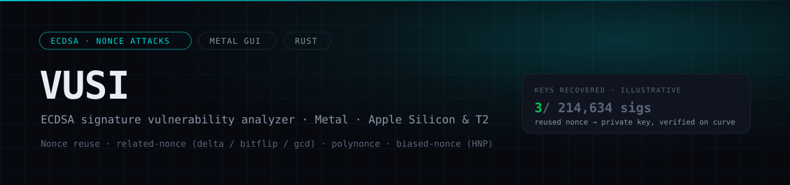
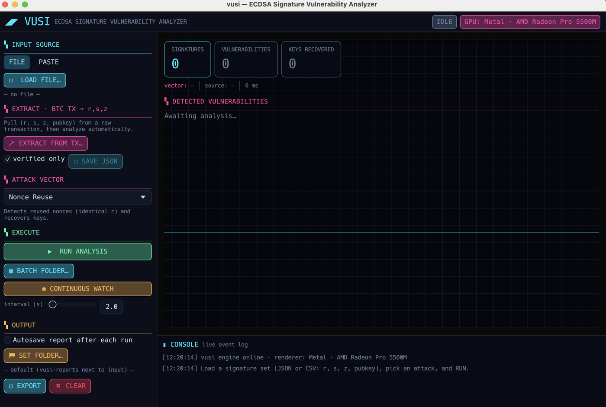

# vusi



<p>


</p>


> **Fork.** Based on [oritwoen/vusi](https://github.com/oritwoen/vusi) (MIT) — the CLI, library and attack engines. This fork adds a native Metal GUI (`gui/`), the shared `vusi-engine` crate, Bitcoin raw-transaction → `(r, s, z, pubkey)` extraction, the **ATXQU** address-transaction pipeline (`atxqu/`), and macOS `.app` packaging. Upstream copyright is retained in [LICENSE](LICENSE).



*The native Metal GUI: load a signature set or extract `(r, s, z, pubkey)` from a raw Bitcoin transaction, pick an attack vector, and run. Rendered through Metal on Apple Silicon / T2.*


[](https://crates.io/crates/vusi)
[](https://crates.io/crates/vusi)
[](LICENSE)
[](https://deepwiki.com/oritwoen/vusi)

ECDSA signature vulnerability analysis library and CLI tool.

> **New: native desktop GUI.** A GPU-accelerated "cyberspace" front-end ships in
> [`gui/`](gui/README.md) — Metal-rendered on Apple Silicon / T2 Macs, with a
> button for every action, batch-folder processing, continuous file watching,
> and autosave. Launch it with `cargo run -p vusi-gui --release` or by
> double-clicking `run-gui.command`. See [gui/README.md](gui/README.md).

## Features

- **Nonce Reuse Detection**: Identifies signatures using the same nonce (k value)
- **Private Key Recovery**: Recovers private keys from vulnerable signatures
- **Multiple Input Formats**: Supports JSON and CSV input
- **Flexible Output**: Human-readable or JSON output formats
- **A full family of nonce attacks** (see below): shared-nonce, reuse-r,
  delta-bias, bitflip (fault), gcd (affine relation), polynonce, biased-nonce
  (low-bit / lll / broken-nonce) and an auto-sweeping nonce-bias mode.

## Attacks

Selected with `--attack <name>`:

| `--attack`      | Idea | Needs |
|-----------------|------|-------|
| `nonce-reuse`   | identical `r` reused (default) | 2 sigs / group |
| `shared-nonce`  | same nonce, grouped by `(r, pubkey)` | 2 sigs |
| `reuse-r`       | reuse of `r`, grouped by `r` alone (flags cross-key reuse) | 2 sigs |
| `delta-bias`    | nonces differ by a known `Δ`: `k2 = k1 + Δ` (`--delta`) | 2 sigs |
| `bitflip`       | single-bit nonce fault, `Δ = ±2^i` swept (`--bitflip-bits`) | 2 sigs + pubkey |
| `gcd`           | unknown small affine relation `k2 = a·k1 + b`, swept (`--gcd-a-max`, `--gcd-b-max`) | 2 sigs + pubkey |
| `polynonce`     | polynomial nonce recurrence | 4+ sigs + pubkey |
| `biased-nonce`  | HNP lattice, fixed `--bias-type {lsb,msb,range}` + `--known-bits` | 4+ sigs |
| `low-bit`       | HNP with known nonce **LSBs** (alias of `biased-nonce --bias-type lsb`) | 4+ sigs |
| `lll`           | HNP with known nonce **MSBs** via LLL (alias of `biased-nonce --bias-type msb`) | 4+ sigs |
| `broken-nonce`  | weak-RNG / range-bounded nonce (alias of `biased-nonce --bias-type range`) | 4+ sigs |
| `nonce-bias`    | generic MSB bias, **auto-sweeps** the known-bit width (`--bias-min-bits`, `--bias-max-bits`) | 4+ sigs |

> **Added in this fork.** Upstream [oritwoen/vusi](https://github.com/oritwoen/vusi)
> ships `nonce-reuse`, `polynonce` and `biased-nonce`. The **related-nonce family** —
> `shared-nonce`, `reuse-r`, `delta-bias`, `bitflip` (single-bit nonce fault),
> `gcd` (unknown affine relation) and the auto-sweeping `nonce-bias` mode, all
> built on the affine two-nonce solver in `src/attack/related_nonce.rs` — is added
> here, along with the Metal GUI, the `vusi-engine` crate, the ATXQU pipeline and
> Bitcoin transaction extraction.

The `delta-bias`, `bitflip` and `gcd` modes share one closed-form
[two-affinely-related-nonce solver](https://eprint.iacr.org/2025/705)
(`d = (a·s2·z1 − s1·z2 + b·s1·s2) / (s1·r2 − a·s2·r1)`); the sweep modes verify
each candidate against the public key.

```bash
vusi analyze sigs.json --attack delta-bias --delta 1337
vusi analyze sigs.json --attack bitflip --bitflip-bits 64
vusi analyze sigs.json --attack gcd --gcd-a-max 8 --gcd-b-max 256
vusi analyze sigs.json --attack nonce-bias --bias-max-bits 24
```

The lattice modes (`biased-nonce`, `low-bit`, `lll`, `broken-nonce`,
`nonce-bias`) require the `biased-nonce` build feature (GMP/MPFR); `polynonce`
requires the `polynonce` feature. Build them with
`cargo build --features polynonce,biased-nonce`.

## From an address to recovered keys: the ATXQU pipeline

vusi analyzes signatures you already have. Getting those signatures **off-chain
for a given address** is what the bundled [`atxqu/`](atxqu/README.md) tool does:
**ATXQU** (Address Transaction Query Utility) fetches every transaction where an
address appears in the inputs (i.e. it *spent* funds) and normalizes each to a
standard transaction JSON. vusi then extracts the `(r, s, z, pubkey)` tuples
from those raw transactions and runs any attack over them:

```
address ──ATXQU──▶ spent transactions (JSON) ──vusi extract──▶ (r,s,z,pubkey) ──vusi attack──▶ keys
```

Two ways to drive it:

```bash
# One command (fetch → extract → analyze):
atxqu/scan_and_analyze.sh 1BvBMSEYstWetqTFn5Au4m4GFg7xJaNVN2 reuse-r

# Or step by step:
python3 atxqu/atxqu_cli.py <address> -o txs.json     # fetch + normalize
vusi analyze --from-tx txs.json --attack reuse-r     # extract + analyze
```

vusi understands raw transaction JSON directly:

```bash
vusi extract txs.json                 # raw transactions → [{r,s,z,pubkey}] on stdout
vusi analyze --from-tx txs.json       # extract, then analyze in one step
```

Extraction reconstructs the legacy-P2PKH `SIGHASH_ALL` sighash and **verifies
each signature** against it, so only genuine `(r, s, z)` tuples reach the
analyzer (SegWit / non-`ALL` inputs are skipped with a reason). See
[`atxqu/README.md`](atxqu/README.md) for ATXQU's own options (batch address
lists, providers, the neon dashboard, resume/pause).

**In the desktop GUI**, the same pipeline is one window: switch the input source
to **ADDRESS**, type an address, pick a provider/endpoint, and hit RUN — the GUI
runs ATXQU, extracts, and attacks in one go. See [`gui/README.md`](gui/README.md).

## Installation

```bash
cargo install --path .
```

## Usage

### Analyze signatures from file

```bash
vusi analyze signatures.json
```

### Analyze from stdin

```bash
echo '[{"r":"...","s":"...","z":"..."}]' | vusi analyze
```

### JSON output

```bash
vusi --json analyze signatures.json
```

## Input Format

### JSON

```json
[
  {
    "r": "6819641642398093696120236467967538361543858578256722584730163952555838220871",
    "s": "5111069398017465712735164463809304352000044522184731945150717785434666956473",
    "z": "4834837306435966184874350434501389872155834069808640791394730023708942795899",
    "pubkey": null
  }
]
```

### CSV

```csv
r,s,z,pubkey
6819641642398093696120236467967538361543858578256722584730163952555838220871,5111069398017465712735164463809304352000044522184731945150717785434666956473,4834837306435966184874350434501389872155834069808640791394730023708942795899,
```

## Exit Codes

- `0`: No vulnerabilities found
- `1`: Vulnerabilities detected
- `2`: Error (invalid input, etc.)

## Library Usage

```rust
use vusi::attack::{Attack, NonceReuseAttack};
use vusi::provider::load_signatures;

let signatures = load_signatures("signatures.json")?;
let attack = NonceReuseAttack;
let vulnerabilities = attack.detect(&signatures);

for vuln in vulnerabilities {
    if let Some(key) = attack.recover(&vuln) {
        println!("Recovered key: {}", key.private_key_decimal);
    }
}
```

## Development

### Run tests

```bash
cargo test
```

### Build release

```bash
cargo build --release
```

## Funding

Donations support a separate, unreleased project I am building, aimed at
Bitcoin. It is my conviction and my bet to make, not a claim to take on trust —
judge it when there is something to judge. This tool stays free either way.

```
bitcoin:1Be6LLAEndprdWKiH6YM62setFQRXJzfha
```

`1Be6LLAEndprdWKiH6YM62setFQRXJzfha` — mainnet P2PKH.

**Verify before you send.** This repository is about analysing ECDSA
signatures, which makes a donation address in it an attractive thing for
someone to quietly swap in a fork or a pull request. Before sending anything
you would mind losing, open an issue and ask me to confirm the address, and
compare the first and last four characters (`1Be6` … `zfha`) against the reply.

Nothing here is an investment offer and no return of any kind is implied.

## License

This project is a fork of [oritwoen/vusi](https://github.com/oritwoen/vusi).
Original work © 2026 oritwoen, MIT. Additions in this fork are likewise MIT.
See [LICENSE](LICENSE).
